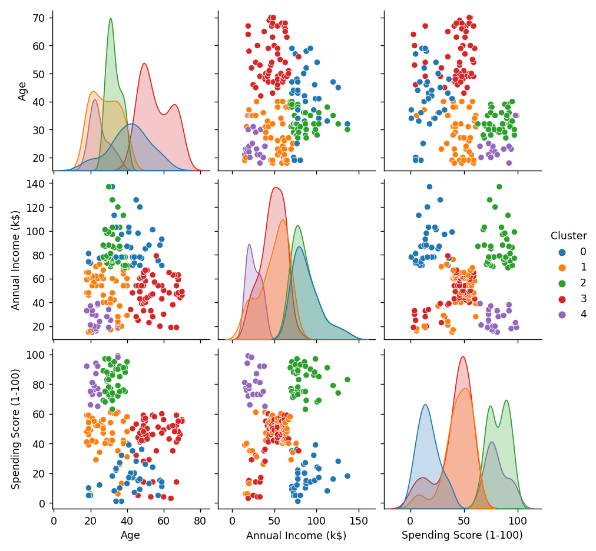
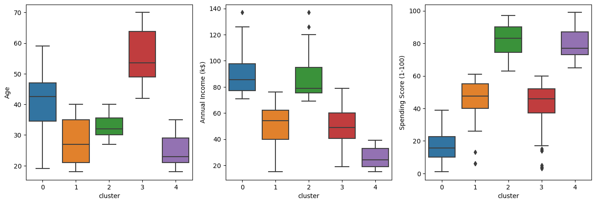

[](https://www.linkedin.com/in/rodrigo-martins-rodrigues/)
[](https://www.python.org/)


# Projeto de clusterização de um supermercado fictício 

Um supermercado, através de cartões de fidelidade, possui alguns dados básicos sobre seus clientes, como idade, gênero, renda anual e pontuação de gastos. Tal pontuação é algo que o supermercado atribui ao cliente com base em parâmetros definidos, como comportamento do cliente e dados de compra. O supermercado deseja entender melhor seus clientes, de modo a formular estratégias de negócios.

[Link original para o dataset](https://www.kaggle.com/vjchoudhary7/customer-segmentation-tutorial-in-python)


## Objetivos

O objetivo do projeto é possibilitar para o supermercado ficticio compreender melhor o perfil dos clientes e dessa forma construir e aplicar estratégias de negócio de acordo. Isso será feito através de um processo de agrupamento de clientes utilizando o dataset disponibilizado.


## Construção deste repositório

O repositório está estruturado da seguinte forma:

```
├── dados
├── imagens
├── modelos
├── notebooks
├── reports
```

- Na pasta `dados` estão os dados utilizados no projeto. O arquivo `Mall_Customers.csv` é o dataset utilizado originalmente. Os demais arquivos são os datasets gerados durante o projeto.
- Na pasta `imagens` estão as imagens utilizadas neste README.
- Na pasta `modelos` estão os modelos gerados durante o projeto. 
- Na pasta `notebooks` estão os notebooks com o desenvolvimento do projeto. Em detalhes, temos:
  - [`Projeto_Supermercado_Pt1_AnaliseExploratoria.ipynb`](notebooks/Projeto_Supermercado_Pt1_AnaliseExploratoria.ipynb): notebook com a análise exploratória dos dados facilitada através da biblioteca [ydata-profiling](https://github.com/ydataai/ydata-profiling) 
  - [`Projeto_Supermercado_Pt2_Modelo.ipynb`](notebooks/Projeto_Supermercado_Pt2_Modelo.ipynb): notebook com a clusterização dos dados usando K-Means após redução de dimensionalidade com PCA utilizando pipelines do Scikit-Learn.
  - [`funcoes_auxiliares.py`](notebooks/funcoes_auxiliares.py): arquivo com funções auxiliares utilizadas nos notebooks.
- Na pasta `reports` estão os relatórios gerados durante o projeto utilizando a biblioteca [ydata-profiling](https://github.com/ydataai/ydata-profiling).


## Detalhes do dataset utilizado e resumo dos resultados

O dataset utilizado é o contido no arquivo [`Mall_Customers.csv`](dados/Mall_Customers.csv), que contém os seguintes dados:

- `CustomerID`: ID do cliente
- `Gender`: sexo do cliente
- `Age`: idade do cliente
- `Annual Income (k$)`: renda anual do cliente
- `Spending Score (1-100)`: pontuação de gastos do cliente

Com o pipeline realizando pré-processamento, PCA e K-Means, a base foi segmentada em 5 clusters, como mostrado nas figuras abaixo:






- Cluster 0: | Pontuação baixa | Salário anual alto | Idade intermediária(Adulto) |

- Cluster 1: | Pontuação intermediária | Salário anual intermediário  | Idade intermediária(Jovem Adulto) |

- Cluster 2: | Pontuação alta | Salário anual alto | Idade intermediária(Adulto) |  

- Cluster 3: | Pontuação intermediária  | Salário anual intermediário | Idade avançada(Idoso) |

- Cluster 4: | Pontuação alta | Salário anual baixo | Idade baixa(Jovem) | 


Transformando os pontos acima em uma tabela:

| Pontuação de Gastos | Salário Anual | Idade         | Class_Idade  |Cluster |
| ------------------- | ------------- | ------------- | -----------  |------- |
| Baixa               | Alta          | Intermediária | Adulto       |   0    |
| Intermediária       | Intermediária | Intermediária | Jovem Adulto |   1    |
| Alta                | Alta          | Intermediária | Adulto       |   2    |
| Intermediária       | Intermediária | Avançada      | Idoso        |   3    |
| Alta                | Baixo         | Baixa         | Jovem        |   4    |


# As bibliotecas utilizadas no projeto

- [ipympl](https://matplotlib.org/ipympl/)<br>
- [ydata-profiling](https://github.com/ydataai/ydata-profiling)<br>
- [sklearn](https://scikit-learn.org/stable/)<br>
- [pandas](https://pandas.pydata.org/docs/)<br>

<p align="center"> 
  <a href="https://www.linkedin.com/in/rodrigo-martins-rodrigues-6a3b53234/" target="_blank"></a> 
</p>


